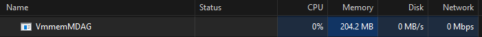
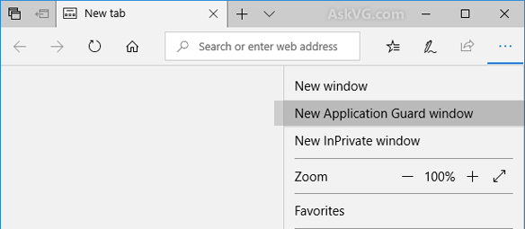
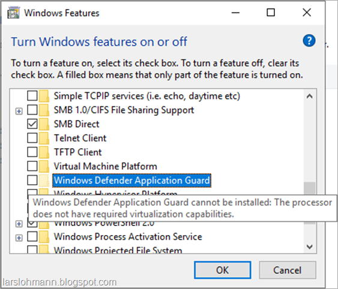
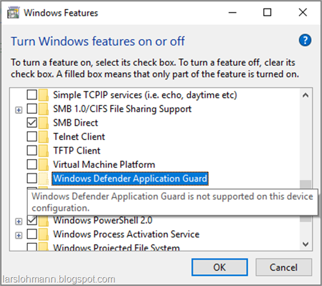

# References
## Microsoft
- [Overview](https://learn.microsoft.com/en-us/windows/security/application-security/application-isolation/microsoft-defender-application-guard/md-app-guard-overview)
- [Requirements](https://learn.microsoft.com/en-us/windows/security/application-security/application-isolation/microsoft-defender-application-guard/reqs-md-app-guard)
- [Preparation](https://learn.microsoft.com/en-us/windows/security/application-security/application-isolation/microsoft-defender-application-guard/install-md-app-guard)
- [Config](https://learn.microsoft.com/en-us/windows/security/application-security/application-isolation/microsoft-defender-application-guard/configure-md-app-guard)
- [Testing](https://learn.microsoft.com/en-us/windows/security/application-security/application-isolation/microsoft-defender-application-guard/test-scenarios-md-app-guard)
- [Browser Extensions](https://learn.microsoft.com/en-us/windows/security/application-security/application-isolation/microsoft-defender-application-guard/md-app-guard-browser-extension)
- [MS Office](https://learn.microsoft.com/en-us/microsoft-365/security/office-365-security/install-app-guard?view=o365-worldwide)
- [Network Boundary](https://learn.microsoft.com/en-us/mem/intune/configuration/network-boundary-windows)

## Blogposts
- https://blog.ciaops.com/2020/05/19/getting-windows-defender-application-guard-wdag-working/
- [WDAGTool](https://techcommunity.microsoft.com/t5/windows-security/defender-application-guard-issues/m-p/1130302)
# How it works
## MS Edge
- all untrusted urls will open in an isolated Hyper-V-enabled container
## MS Office
- untrusted files e.g. word, excel, powerpoint will be opened in an isolated Hyper-V-enabled container

> Hardware Isolation

# System Requirements
#todo learn #iommu #slat #cpu_virt

|Hardware|Description|
|---|---|
|64-bit CPU|A 64-bit computer with minimum four cores (logical processors) is required for hypervisor and virtualization-based security (VBS). For more info about Hyper-V, see [Hyper-V on Windows Server 2016](https://learn.microsoft.com/en-us/windows-server/virtualization/hyper-v/hyper-v-on-windows-server) or [Introduction to Hyper-V on Windows 10](https://learn.microsoft.com/en-us/virtualization/hyper-v-on-windows/about/). For more info about hypervisor, see [Hypervisor Specifications](https://learn.microsoft.com/en-us/virtualization/hyper-v-on-windows/reference/tlfs).|
|CPU virtualization extensions|Extended page tables, also called _Second Level Address Translation (SLAT)_ **AND** One of the following virtualization extensions for VBS:   VT-x (Intel)   **OR**   AMD-V|
|Hardware memory|Microsoft requires a minimum of 8-GB RAM|
|Hard disk|5-GB free space, solid state disk (SSD) recommended|
|Input/Output Memory Management Unit (IOMMU) support|Not required, but recommended|

# Software Requirements

|Software|Description|
|---|---|
|Operating system|Windows 10 Enterprise edition, version 1809 or later   Windows 10 Professional edition, version 1809 or later   Windows 10 Professional for Workstations edition, version 1809 or later   Windows 10 Professional Education edition, version 1809 or later   Windows 10 Education edition, version 1809 or later   Windows 11 Education, Enterprise, and Professional editions|
|Browser|Microsoft Edge|
|Management system   (only for managed devices)|[Microsoft Intune](https://learn.microsoft.com/en-us/intune/) **OR** [Microsoft Configuration Manager](https://learn.microsoft.com/en-us/configmgr/) **OR** [Group Policy](https://learn.microsoft.com/en-us/previous-versions/windows/it-pro/windows-server-2008-R2-and-2008/cc753298(v=ws.11)) **OR** non-Microsoft mobile device management (MDM) solution|

# MS Office Install and Config
- [MS Learn](https://learn.microsoft.com/en-us/microsoft-365/security/office-365-security/install-app-guard?view=o365-worldwide)
# Monitoring
- Windows Task Manager
	- 
- Edge icon in App Guard mode
	- 
# Troubleshooting
## Issue 1
- MDAG is installed but 'New Application Gurad Window' does not appear in MS Edge - the image below shows the healthy AppGuard installation
	- 

### Solution
- Check `Windows Features` and make sure `Microsoft Defender Application Guard` is installed. If not, especially if it's grayed out, hover your mouse pointer over it to find out the reason it failed to install.
- Run the following command
	- `%Windir%/System32/wdagtool.exe cleanup RESET_PERSISTENCE_LAYER`
	- [Reference](https://learn.microsoft.com/en-us/windows/security/application-security/application-isolation/microsoft-defender-application-guard/configure-md-app-guard#application-specific-settings)

## Issue 2
- Virtualization capability missing
- Check `Windows Features` and hover the mouse pointer over `Microsoft Defender Application Guard`. 
	- 

### Solution
- #todo

## Issue 3
- MDAG not supported
	- 

### Solution
- #todo 
