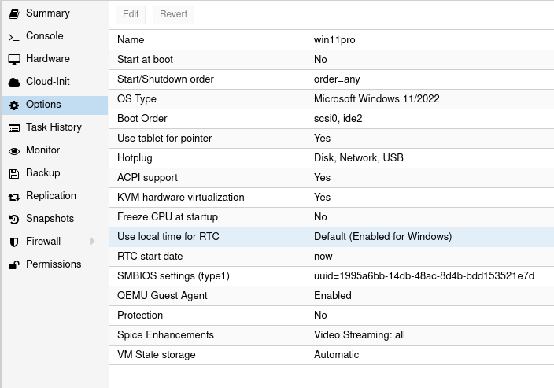

# Documentation
https://pve.proxmox.com/wiki/
https://pve.proxmox.com/pve-docs/

# Installation
## Download
Download ISO image from https://www.proxmox.com/en/downloads/category/iso-images-pve
## Prepare USB
burn ISO to USB device
```sh
lsblk -pf    # find the path to usb device e.g. /dev/sdb
udo dd if=/path/to/proxmox-ve_7.3-1.iso of=/path/to/usb status=progress bs=1M conv=fdatasync
```
## Boot into USB 

## Install Proxmox


## Access via Web UI
`https://localhost:8006`

## Prepare Storage
Remove local-lv from storage
In shell:
- `lvremove /dev/pve/data`
- `lvresize -l +100%FREE /dev/pve/root`
- `resize2fs /dev/mapper/pve-root`
- Make sure the Content settings for the storage includes **Disk image** and **Containers**
	- Datacenter > Storage > Edit > Content

You may either upload `.iso` files and install a vm, or import .qcow2 images.

## CLI General Commans
### VMs
`qm list`
`qm start`
`qm shutdown`: soft shutdown
`qm reboot`: soft reset

`qm stop`: power off
`qm reset`: hard reset

`qm config $vm_id`
`qm set --$config_name $value $vm_id`
`qm rescan`: Scan for available disks

### Containers
`pct list`
`pct config $vm_id`
`pct enter $vm_id`: get a shell into the container

## Import Disk (qcow2)
https://ostechnix.com/import-qcow2-into-proxmox/
First create a VM without any OS installed, then import qcow image.
In the WebUI, select the node (proxmox instance), and select Shell:
```sh
qm importdisk $vm_id /path/to/vm_disk.qcow2 $storage_name     # import qcow2 image
qm importdisk $vm_id /path/to/vm_disk.vmdk $storage_name -format qcow2    # import vmdk image and convert to qcow2
```
Then configure the disk:
- from Web UI, select the vm > Hardware:
	- There should be two hard disks imported:
		- `.raw`: This should be set to *VirtIO Block*
		- `.qcow2`: This should be set to *IDE*
- select Options > Boot:
	- bring virtio to the top, followed by ide, then others

## Import Storage with ZFS 
`zpool import -f $zfs_name`
`zpool list` : to confirm it was imported


## Windows Drivers
> virtio iso to be downloaded and mounted AT THE TIME OF INSTALLATION
https://fedorapeople.org/groups/virt/virtio-win/direct-downloads/stable-virtio/virtio-win.iso
> Spice Guest Tools
https://www.spice-space.org/download/windows/spice-guest-tools/spice-guest-tools-latest.exe
- Installation Guide
https://www.youtube.com/watch?v=eyNlGAzf-L4&list=PLT98CRl2KxKHnlbYhtABg6cF50bYa8Ulo&index=6
After installation there would be two devices with missing drivers in Device Manager:
1) PCI Device: This one is the balloon driver for memory - install from virtio iso
2) PCI Simple Communication Controller: This one is VirtIO serial driver
OR simply install the whole VirtIO suite of drivers.
## Hardware

## Options


# Remnux
## Drivers
`sudo apt install spice-vdagent`: optional
https://docs.remnux.org/install-distro/get-virtual-appliance#kvm-qemu
https://docs.remnux.org/install-distro/get-virtual-appliance#proxmox
## Hardware

## Options


## Common issues
**Issue**: After boot display might look black
**Workaround**: Press 'Ctrl + Alt + F2' to change to tty2 and then 'Ctrl + Alt + F1' to go back to Desktop. 

**Issue**: DHCP might not connect to DHCP server and obtain an IP address
**Workaround**: try the following command
```sh
dhclient
```

