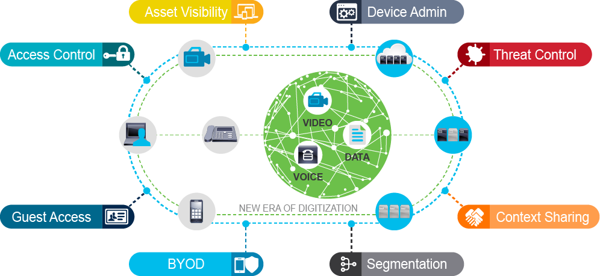

- Administrator access to network devices can be more securely managed using *TACACS+* rather than *RADIUS*. 
- *RADIUS* is generally used more for user network access control.
- The ability to do segmentation beyond the constraints of the traditional layer-2 and 3 segmentation greatly benefits not only network security, but it also helps simplify network design.
- *Cisco ISE* is a centralized network access control and policy enforcement platform.
- *Cisco ISE* gathers key information about users and devices attempting to connect to the network as well as administrators connecting to network device management consoles and uses that data to provide controlled access. The gathered information can also be used to ensure regulatory compliance to various government and industry standards or be shared with other Cisco ecosystem partner devices using *pxGrid* or APIs.

# Digitization Brings New Security Challenges

# Visibility and Access Control

# Cisco Identity Services Engine

- [1] SISE, a centralized network access control and policy enforcement platform

Cisco ISE can also use gathered information to ensure regulatory compliance to various government and industry standards. This information can be shared among Cisco Ecosystem partner devices using *Platform Exchange Grid (pxGrid)* or application programming interfaces (APIs). The sharing of this data is used to enhance the capabilities for services including security information and event management (*SIEM*), mobile device management (*MDM*), network behavior analysis (*NBA*), intrusion prevention systems (*IPS*), and much more.

# Secure Access Control

## Data Collection
- Network: DHCP, NetFlow
- User: AD, LDAP integration
## Enforcement
- 802.1x
- VLAN control
- flexible authentication
- downloadable access control lists (dACLs)
- Scalable Group Access (SGA)
- device profiling
- compliance posture assessments
- guest access management
- [1] Tight integration between SISE and NADs make these possible

# Cisco ISE Deployment Overview

The *NAD* is the device to which users connect for network access. It is therefore a *key policy enforcement point* for a security solution. For RADIUS-based authentication, Cisco ISE acts as a RADIUS server, and the NADs act as RADIUS clients.

- [i] *Corporate users* often authenticate via the *IEEE 802.1X* protocol
- [i] *guest* users typically authenticate using Web Authentication (*WebAuth*)
- [i] *Specialty devices* such as printers or handheld scanners may not support these authentication methods and therefore use *MAC Authentication Bypass* (*MAB*).

