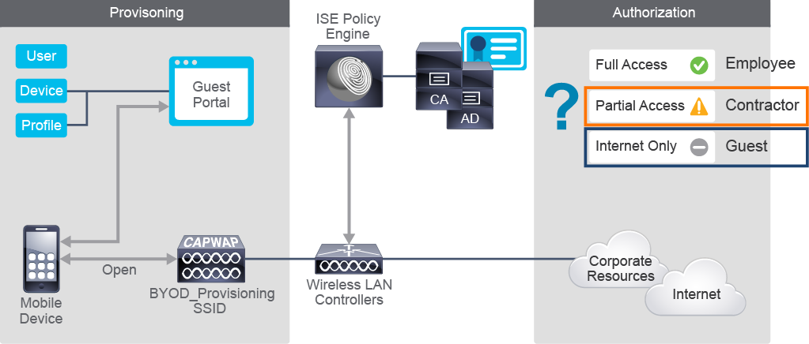
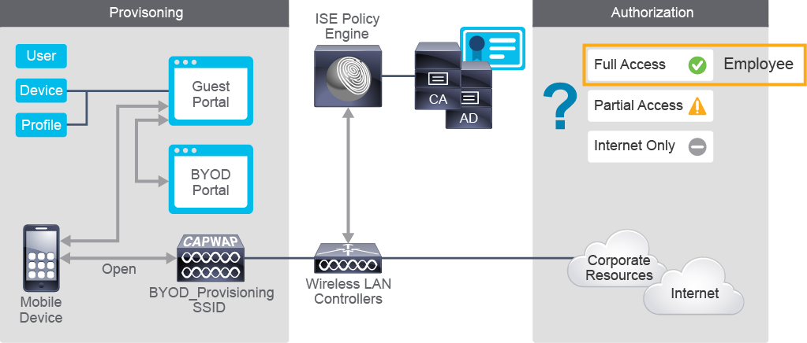
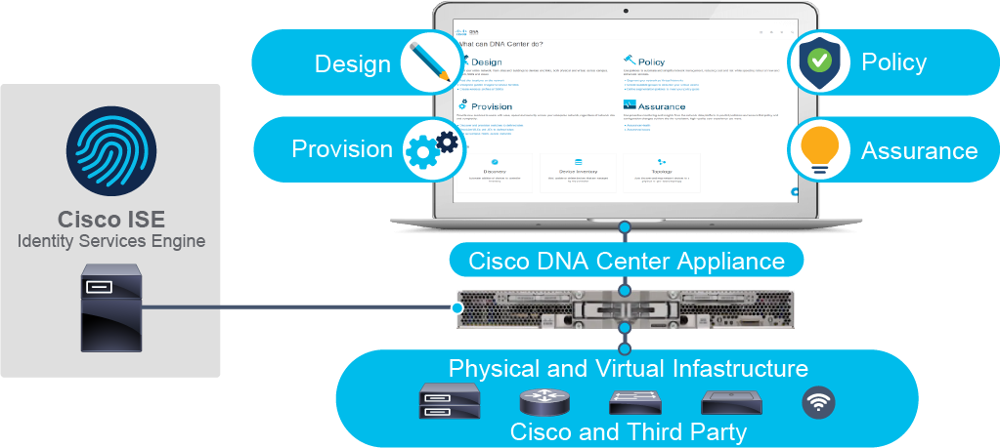

## Guest Use Case

Supporting various types of access, such as guest or contractor, while also improving network security is a challenging endeavor.

- Common guest use cases that Cisco ISE provides: 
	- Hotspot access: no credentials needed
	- Self-Registered Guest Access: through a portal
	- Full-Sponsored Access: a role-based access that requires an employee to act as a sponsor to provide guests or contractors with internet or other types of access

## BYOD Use Case

Mobile devices are transforming culture and creating significant security challenges. If you allow employees to connect personal devices to corporate networks, you can improve employee satisfaction and productivity. However, corporations may not be able to control what software users install on these devices, increasing the risk of security incidents and potential lawsuits.

The preceding figure expands the guest use cases that Cisco ISE provides to allow employees to access corporate resources with their personal devices.

IT managers need visibility and control to track what those devices are, who is using them, and where and when they connect. You can use this information to establish and enforce BYOD security policies to protect sensitive and confidential assets from inadvertent or overt compromise and efficiently manage lost or stolen devices.

## Profiling Use Case
You might want to create a complete inventory of which devices access your network—printers, smart phones, tablets, laptops, IP cameras, and other devices. However, the time and personnel necessary to perform this task can be daunting and reduce your awareness and your ability to enforce appropriate policies based on device types.

The solution is the ability of Cisco ISE to perform device profiling in addition to typical authentication and authorization services. It analyzes endpoint network traffic characteristics to identify device types and operating systems, including Windows laptops, Cisco IP Phones, Google Android smart phones, Apple iOS tablets, and other devices. This analysis is useful for developing advanced authorization policies, such as imposing a policy that prevents smart phone users from accessing financial data.

## Compliance Use Case
It can be challenging to determine whether connecting endpoints have the latest operating system version, software, patches, and virus protection.

As endpoints access the network, Cisco Posture services can perform various software and operating system checks. For noncompliant devices, Cisco ISE can offer remediation actions to increase network security and control. Cisco ISE can also integrate with third-party mobility device management (MDM) vendors to further enhance this level of awareness and control.

## Device Administration with TACACS+ Use Case
Cisco ISE has always supported end user and endpoint authentication, authorization, and accounting (AAA) using the RADIUS protocol. However, RADIUS is not optimal for supporting administrative access to network devices such as switches, routers, and firewalls. Since the TACACS+ protocol is more suitable for controlling administrative device access, in the past, most corporations deployed a separate product such as Cisco Secure Access Control Server (Cisco Secure ACS) for administrative access.

Beginning with release 2.0, Cisco ISE supports TACACS+. This support means that you can migrate your Cisco Secure ACS deployment to Cisco ISE and gracefully decommission Cisco Secure ACS. Therefore, you can now have a single, centralized policy engine to support both end user access to network resources and administrative access to network devices.

## Context Exchange with pxGrid Use Case
Cisco ISE maintains contextual information about connection sessions—who, what, how, where, and when. Beyond Cisco ISE, many other Cisco and third-party platforms could benefit from this information. Likewise, Cisco ISE might be able to benefit from information gleaned from other platforms.

Cisco Platform Exchange Grid (Cisco pxGrid) provides a secure communication framework to share context information with Cisco ISE Ecosystem partners and other Cisco platforms. Cisco ISE acts as the controller to authenticate and authorize Cisco pxGrid clients. For example, Cisco Secure Firewall can register as a client and gain access to user/endpoint identity information. Thus, it can limit user access based on Active Directory group membership (the contextual who).

Perhaps an MDM product joins the grid with detailed information about device OS levels, patches, and virus protection. Since all these devices can share information across the grid, you have increased situational awareness and the ability to respond to and mitigate threats.

## Threat-Centric Network Access Control Use Case
Cisco ISE has a tremendous ability to control authentication and authorization based on contextual information. It can even modify authorization levels based on profiling information. However, the access policies are relatively static—they are not dynamically adjusted based on threats.

Threat-Centric Network Access Control (TC-NAC) enables you to create authorization policies based on threat and vulnerability attributes that Cisco ISE receives from threat and vulnerability adapters. Cisco supports various vulnerability adapters, including the following:

- SourceFire FireAMP
- Cognitive Threat Analytics adapter
- Qualys
- Rapid7 Nexpose
- Tenable Security Center

These adapters send information like Indications of Compromise, Threat Detected events, and Common Vulnerability Scoring System scores to Cisco ISE. You can then create threat-centric access policies to change the privilege and context of endpoints accordingly.

## Software Defined Segmentation Use Case
Corporate security policy is often implemented via a Layer 3, or IP-based, mechanism such as access list or firewall rules. These policies can get quite lengthy, become unwieldy, and be spread out over dozens or even hundreds of routers, switches, and firewalls. There is little obvious relationship between an IP-based policy and how businesses are actually organized.

To meet these challenges, Cisco TrustSec technology uses scalable group access to impose highly granular access policies that are based on device type, host, or user. You define your policy based on how your corporation is organized into business units or groups and scalable group access abstracts it from your IP addressing scheme, independently of your network topology.

Scalable group access is also centrally administered via Cisco ISE, as opposed to hundreds of access rules spread out over your entire infrastructure. This feature can reduce IT administrative overhead under normal conditions, especially when you must redesign your topology or IP addressing schema.

## Software-Defined Access Use Case
Cisco ISE provides a centralized policy engine that integrates with various identity stores. It also integrates with many other services and platforms via Cisco pxGrid including Cisco Digital Network Architecture (Cisco DNA) with Cisco Software-Defined Access (SD-Access).

The Cisco DNA architecture allows you to take advantage of the latest advances in network automation, control, monitoring, and security and enables you to more quickly and consistently design new networks, reprovision existing networks, and create policy for those networks. You can then provision network devices with that policy, along with automated device image management and other features. You also have complete monitoring and diagnostic capabilities from the Cisco DNA Center single GUI interface.

As opposed to traditional IP subnet and VLAN-based methods of deploying, segmenting, and securing network resources and network access, the Cisco DNA solution uses TrustSec and other features to provide an intent-based paradigm.

## Cisco Digital Network Architecture
The need for secure, zero-trust networking is growing as campus networks become more distributed and offsite IT teams become the norm. Network management needs to have more extensive control and optimization. Having a network environment that can be managed from a single dashboard will help you optimize your Cisco investment, secure your remote workforce, and lower your IT spending.

Cisco DNA is composed of several components and is managed from the GUI-based Cisco DNA Center that provides four key functions:

- **Design:** You build out your hierarchy of corporate regions, campuses, buildings, and floors. You can then indicate wiring and access point locations to derive heat maps for RF planning. You can also design your IP addressing schema, wireless network SSIDs, and take care of OS image management. The idea is that instead of using various spreadsheets, drawing software, and other tools for network design, you can do everything in Cisco DNA Center. This information can then be more easily pushed down to actual network devices in a more automated way.
    
- **Policy:** You can build out virtual networks for user segmentation, access control policies, and application priority schemes for quality of service (QoS) policy. For security, Cisco DNA uses TrustSec and scalable group tags (SGT). You create virtual networks, which create virtual routing instances on your Layer 3 devices called virtual route forwarding (VRF) entities. You can then associate various users, endpoints, and groups to these entities to control who can do what. This group/entity information is pulled from Cisco ISE.
    
- **Provisioning:** The previous two functions, Design and Policy, can be performed before deploying or even purchasing your equipment. Once that equipment arrives, you can provision it through Cisco DNA Center. All your previous addressing, operating system image, WLAN, and security efforts can be pushed down to the Fabric devices. To facilitate this push, you create logical fabrics. These logical fabrics are often geographically based. You place icons representing your actual hardware into these fabrics. This provisioning function contains information similar to the information from the many Cisco Validated Design documents. Thus, your configuration conforms to best practices with far less effort.
    
- **Assurance:** This function provides for monitoring and troubleshooting capabilities.

Cisco ISE integrates into Cisco DNA for dynamic mapping of users and devices to scalable groups. This integration simplifies security policy management and enforcement and is far more scalable than traditional network policy implementations that rely on IP access lists.

Cisco ISE and Cisco DNA-C are tightly integrated, with management of the policies driven by Cisco DNA-C. Cisco ISE integrates with Cisco DNA-C via Cisco pxGrid and REST APIs to exchange client information and automate fabric-related configurations on ISE. SGTs are centrally defined, managed, and administered by Cisco ISE.

Cisco DNA-C uses an analytics engine to collect telemetry information from the fabric about users, devices, and things. It collects this information, does some number crunching, and presents it to you in a more consumable manner.
