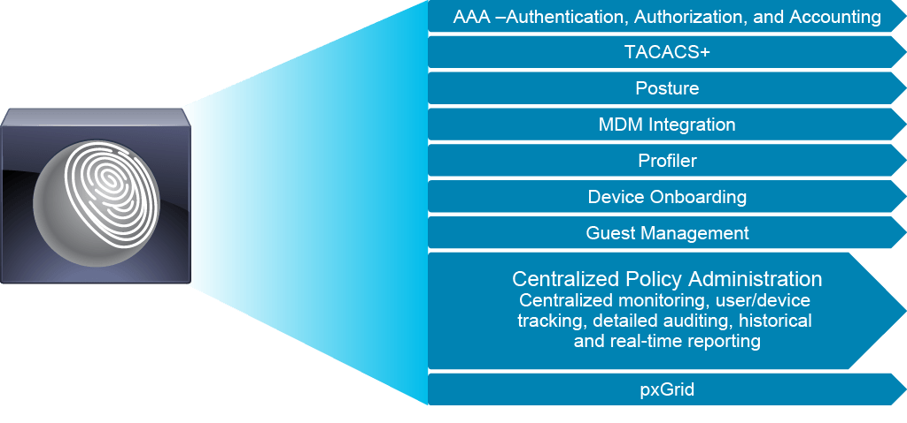
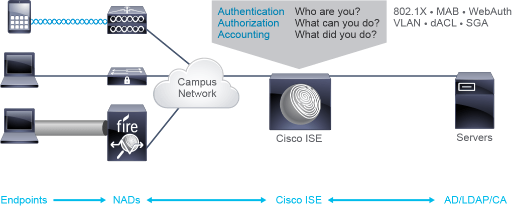
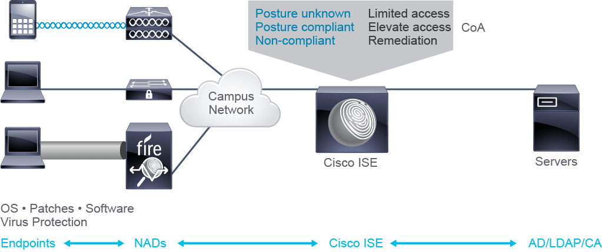
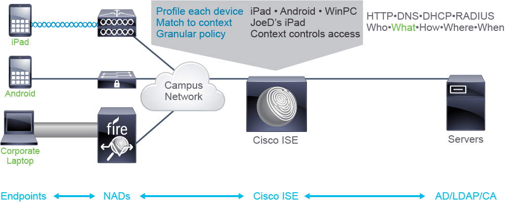
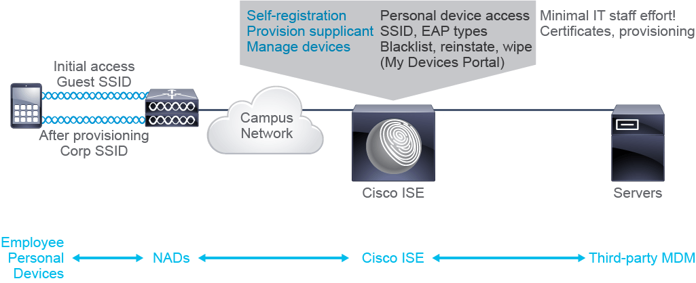
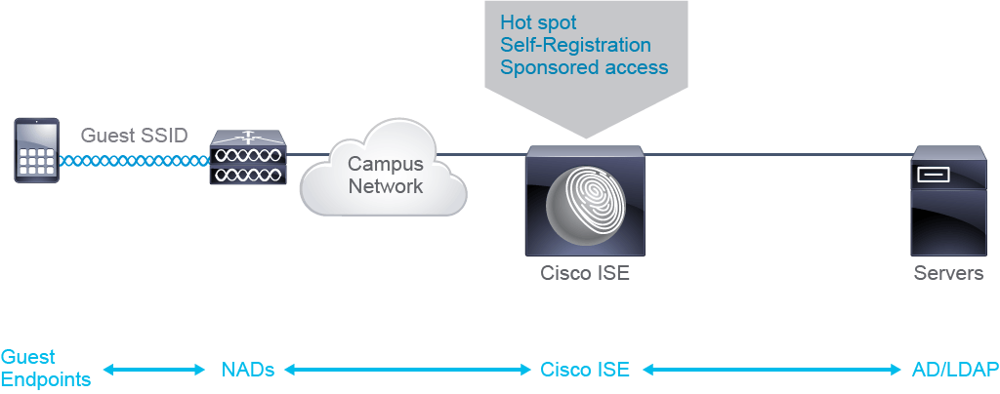
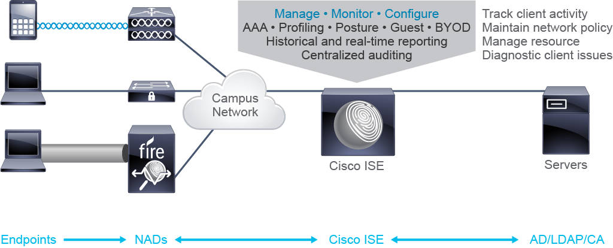
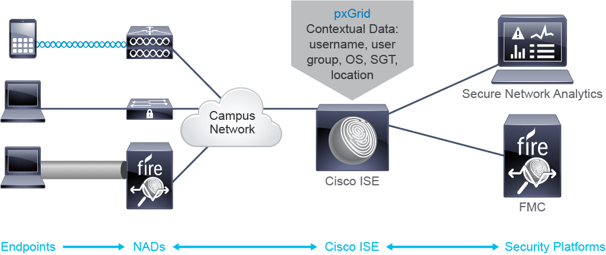

## Cisco ISE Functionality

The heart of the Cisco secure access solution is Cisco Identity Services Engine (ISE). It provides a centralized, identity-based policy platform for context-aware access control across the wired, wireless, and VPN infrastructure. Cisco ISE combines authentication, authorization, and accounting (AAA), TACACS+, posture, profiling, and guest management features in a single unified appliance, providing a single point for policy management, monitoring, and troubleshooting.

The switched, routed, and wireless infrastructure provides the policy enforcement building blocks. Cisco ISE works with network access devices (NADs) to ensure that endpoints can only access appropriate resources.

Cisco ISE central monitoring features collect user identity and endpoint information and share this information with other components in the overall solution. Additional functionality is available as software elements installed on the endpoints, such as the Cisco AnyConnect Mobility client, Cisco Network Admission Control (NAC) Agents, and mobile device management (MDM) integration.

Cisco ISE supports TACACS+ for device administration, Cisco Platform Exchange Grid (Cisco pxGrid) for sharing information with other platforms, and integration with the Cisco Software Defined Network (SDN) solution—Cisco Digital Network Architecture (Cisco DNA).

## AAA RADIUS Services

Integrated RADIUS services enable authentication, authorization, and accounting (AAA), typically used for end user network access. User identities can be validated against an internal Cisco ISE database, back-end Microsoft Active Directory, or Lightweight Directory Access Protocol (LDAP) servers.

There are three supported primary authentication methods: 802.1X, MAC Authentication Bypass (MAB), and Web Authentication (WebAuth).

802.1X authentication is used for typical endpoints. This standards-based authentication method is for wired and wireless connections used with corporate employee access.

MAB is used for endpoints that lack 802.1X capability, but whose MAC address is known by administrators when they connect. These devices include specialty items such as IP cameras, printers, handheld scanners, and other devices.

If an endpoint lacks 802.1X capability and its MAC address is unknown, as with personal user devices, the user can be verified by authenticating via a web page using WebAuth.

Authentication determines whether the user can access the network. After the Cisco ISE RADIUS service verifies user identity and processes account attributes, it can apply an authorization profile to the session. Cisco ISE sends this authorization policy to the NAD in a RADIUS Access-Accept reply. This authorization policy controls what actions a user can perform. Accounting then tracks user actions, when and where they logged in, what they accessed, and more.

## AAA TACACS+ Services

Integrated TACACS+ services enable AAA, typically used for administrative access to network devices. Administrator identities can be validated against an internal Cisco ISE database, back-end Microsoft Active Directory, or LDAP servers.

Network administrators connect to network devices using SSH, Telnet, HTTP/HTTPS, or a direct serial port connection from their laptop or other device.

When an administrator accesses network devices for administration, the network devices act as AAA clients. For authentication, the network devices gather user credentials and relay them to the AAA server via the TACACS+ protocol. Assuming that the credentials are valid, the user is authenticated to access the network device. Authorization requires that each action that the user attempts to perform must be authenticated against the AAA server.

Accounting can track administrator actions, when and what network device they logged into, what actions they took, and other information.

## Posture Compliance and MDM Integration

When a user connects to a secure part of the corporate network, they should be following all security and corporate policies. However, if the security state of that device needs to be verified, network administrators do not want to have to perform that verification manually.

Posture assessment allows Cisco ISE to dynamically validate and maintain endpoint security capabilities. You can configure the initial RADIUS authentication to grant only limited client access. After initial client access, posture assessment can validate endpoint OS and patch versions, virus protection, and other compliance requirements as defined by corporate security policy. If the device meets this criteria, elevated access can be granted by using change of authorization (CoA) messaging. If devices are non-compliant, you can engage remediation functions.

This feature helps to ensure that endpoints conform to defined security standards and can be enhanced even further via integration with third-party mobile device management (MDM) solutions. Cisco ISE integrates with MDM platforms to provide superior posture compliance and device control.

You can use profile and posture information to determine authorization policy. Authorization generally relies on the standards-based CoA mechanism. Using CoA, RADIUS servers inform NADs to raise or lower endpoint authorization levels after the initial authentication and authorization exchange.

## Profiler

Understanding the capabilities of devices that are connected to the network can help enhance network security. Authentication will determine who the user is, but knowing the type of device that the user is connecting to the network can be just as important. For example, devices that use MAB instead of 802.1X may need more contextual information to match the correct security policy. Trying to determine endpoint capabilities manually would take too much time and effort that could be put to better use elsewhere.

With the correct licensing, ISE can dynamically collect endpoint data and determine the capabilities of endpoints that are connected to the network. This contextual information allows ISE to make a very granular policy match, ensuring that the most appropriate level of access is applied.

When an endpoint connects to the network the first time, ISE has very little information about that endpoint. After initial authentication, devices can be placed in an “unknown” category.

Once the endpoint is connected to the network, it will begin interacting with the network. The profiling service will then collect data from that interaction to probe key characteristics such as interactions with HTTP, Domain Name System (DNS), DHCP, and RADIUS services. The profiling service can then use this information to determine the device type and place it in a defined category such as Android, Apple, or iPad. An internal endpoint database stores the profiling results to streamline subsequent authorization and categorization.

Once Cisco ISE is aware of the contextual “what”, it can match it with “who”, “how”, “where”, and “when”. It can use this context to create very granular policy: When user “JoeD” logs in using his personal iPad from a public café, he is given limited access. But when he logs in using his corporate laptop from his desk at the office, he gains elevated levels of access.

## Device Onboarding

The process of having the IT staff configure users’ personal devices for bring your own device (BYOD) endpoints to be used on the corporate network can be time consuming. However, Cisco ISE’s self-registration portal enables users to be responsible for onboarding their own devices. This portal is easy for end users to use, with minimal intervention by IT, to provide a more graceful user experience.

Supplicant provisioning automates client device configuration parameters, such as the wireless Service Set Identifier (SSID), preshared keys, Extensible Authentication Protocol (EAP) types, and more. It also gives the ability to easily block and wipe lost or stolen devices and reinstate them as necessary.

Supplicant provisioning provides automatic provisioning of certificates with a unique device identifier (UDI), MAC address, and other attributes. Its integration with leading MDM platforms ensures that user endpoints meet corporate requirements. These requirements may include checking whether the device has been “rooted” and whether patch levels and virus updates are correct. Furthermore, the ability to add, delete, and modify local applications is monitored and can be limited, enabling the containerization of corporate data.

With device onboarding, you can use the guest network SSID to accommodate both employee self-registration and guest access. After provisioning, corporate users connect to a secure corporate SSID, and because guests are identifiable by their credentials, they continue to have limited access via the original guest SSID.

## Guest Management
Cisco ISE provides a complete system for guest life cycle management.

Guest users can access the network for a limited time by using either a sponsored account or an autonomous login and a guest portal. Administrators can customize guest portals and policy based on the specific needs of the enterprise.

## Centralized Administration and Monitoring

Cisco ISE provides the central interface to manage, monitor, and configure AAA services, profiling, posture, guest management, and BYOD services.

Administration and monitoring features enhance the ability to track client activity, maintain network policy, manage network resources, and diagnose client issues. Centralized auditing and historical and real-time reporting are readily available.

Cisco ISE provides a dashboard to simplify policy creation, visibility, reporting, and regulatory compliance. Administration and monitoring of all Cisco ISE components, even with distributed deployment, is accomplished via a web browser connection to a single centralized interface. Endpoint data that is learned from Cisco pxGrid or APIs is also merged with data collected and used by ISE, thus reducing the number of administrative touch points required for network monitoring.

## pxGrid

Cisco ISE serves as the central component for Cisco pxGrid, a protocol that allows for the exchange of endpoint data between network management, monitoring, and security platforms.

Contextual data that ISE collects about endpoints can be exchanged, allowing for contextual policies to be applied on other platforms. For example, firewall policies created in Cisco Firepower Management Center could be based on Scalable Group Tags (SGTs) instead of IP addresses, reducing the complexity of those policies. Likewise, rules configured in Cisco Secure Network Analytics (formerly Cisco Stealthwatch Enterprise) could match to usernames/groups and operating system, reducing the number of false positive and false negative alarms being generated.